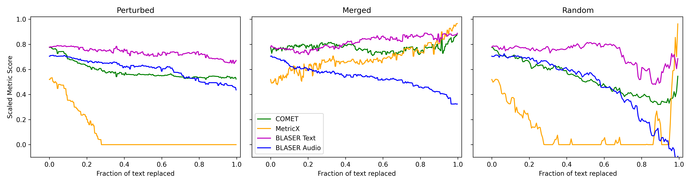
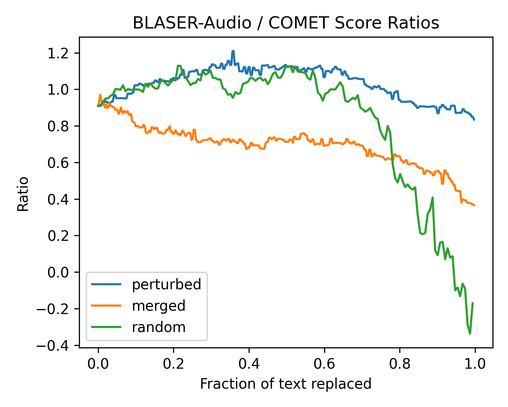

# Impact of ASR Errors

This is a short, pretty contrived, example of how ASR errors may impact the different metrics. The hope was to demonstrate that BLASER-2 has a clear advantage in this regard.

1. Take a source audio file and ground truth transcript from the WMT24 speech subset.
2. Create sequences of modified source transcripts, from identical to the ground truth transcript to very different to it, by various strategies.
3. Translate the modified source transcripts to Spanish.
4. Compute reference-free metrics between the modified source texts and their translations (with QE variants of BLASER-2 text, MetricX, and COMET)
5. Compute the BLASER-2 scores when using the original source audio as input and the translations of the modified source text.

We would expect the BLASER-2-audio score to drop much more quickly than the COMET/MetricX/BLASER-2-text as the transcripts are made progressively worse, as it is the only metric that has access to the original audio (everything else is attempting to measure similarity between the transcript and translation, not the source and translation).

## Input Data

All the scripts use a single source audio file from the WMT24 subset, available here: https://data.statmt.org/wmt24/general-mt/. The specific file is: `test-en-speech-audio/YGkZRb3aer8_001.wav`.

The transcript and reference translation for this file are available here: https://storage.googleapis.com/mt-metrics-eval/mt-metrics-eval-v2.tgz. The data corresponding to the WAV file above is line 792 of the English to Spanish (`en-es`) files under `wmt24/sources` (for the transcript) and `wmt24/references`.

For more details about the WMT24 data see the repo: https://github.com/google-research/mt-metrics-eval, and web-site: https://www2.statmt.org/wmt24/translation-task.html

This file and the associated text are saved as `data/source.wav`, `data/source.txt`, and `data/reference.txt` here.

### Corrected Transcript

`data/source_corrected.txt` contains a corrected version of the source transcript, which in WMT24 is originally generated by ASR. The original source contains a few minor errors, the most noticeable being an instance of "bubbles" instead of "baubles". The corrected source is used as the original source for all the experiments.

## Modified Sources

Three sets of modified sources are saved, each with a sequence varying from text very different to the original source (see strategy details below) and then iteratively becoming closer to the original source, with the final sample containing exactly the original source text.

None of the strategies produce text that is a realistic representation of likely ASR errors, but they may give an idea of how the metrics perform in some extreme edge cases.

### "Perturbed" Strategy

For each word in the original source, Llama 3.2 (3B) is prompted with `What is a similar word to "{w}"? Reply with only a single word.`, to get a list of words the are somehow 'similar' to each word. A set of sources is saved with a varying number of words replaced with the supposedly 'similar' words.

This creates quite non-sensical text, for example original source text of

> To create the antique brass ornament, I just went in with a coat of...

becomes

> Also generate itself vintage copper garnish, Me simply went within alongside an jacket...

These sources are saved in `data/source_perturbed` and generated with `perturb_source.py`.

### "Merged" Strategy

The original source text is swapped to text from a different source part-way through. The alternative source text is saved in `alt_source.txt`, and is from line 781 of the WMT24 en-es data (see data details above).

For example, original source text of:

> To create the antique brass ornament, I just went in with a coat of...

becomes:

> To create the antique With digital tools, it is easier than ever to create...

These sources are saved in `data/source_merged` and generated with `merge_source.py`.

### "Random" Strategy

A varying number of words, selected at random, are deleted from the original source text.

For example, original source text of:

> To create the antique brass ornament, I just went in with a coat of...

can become:

> the of then we that antique with and antiqued After I more of the to brass they...

These sources are saved in `data/source_random` and generated with `merge_random.py`.

## Translations

The script `translate.py` is used to translate each modified source into Spanish using [Azure AI Translator](https://azure.microsoft.com/en-us/products/ai-services/ai-translator), which requires a source group name (perturbed/merged/random) and for a key for the translator service to be set in a `AZURE_TRANSLATE_KEY` environment variable.

The translations are saved in `data/translations_[perturbed,merged,random]`.

## Metrics Data

The scripts `run_blaser.py`, `run_comet.py`, and `run_metricx.py` save metric scores for a given group (taken as an argument to the script). I just ran this on a laptop so used smaller variants of COMET and MetricX (`Unbabel/wmt22-cometkiwi-da` and `google/metricx-24-hybrid-large-v2p6`).

The scores are saved in the `data/scores` directory.

## Results

See the script `results.py`, which makes the outputs `data/results.png`, `data/blaser_comet_ratios.png`, and `data/[merged,perturbed,random]_scaled_scores.csv`.

Metric scores are roughly scaled to 0-1 and sign-flipped so higher is better (for MetricX). The absolute values should be relied on too heavily, and BLASER-2 in particular doesn't seem to restrict itself to the 1-5 range of XSTS scores as intended (which causes some negative scores in the plots below where BLASER-2 returned a score below 1).

The expectation is the BLASER-2 Audio score (using the original source audio) should decrease fastests as the text transcript (and so the resulting translation) is modified.

### Metric Scores for Each Source Modification Group

### Ratio Between BLASER-2 Audio Score and COMET Score for Each Source Modification Group

### Initial thoughts

- BLASER-2 Audio is clearly best on the "merged" transcript perturbation strategy. As the transcript diverges from the original source the BLASER-2-Audio score drops whilst the others stay flat or even increase. This strategy produces normal-looking English text sources apart from having a topic switch in the middle, whilst the others produce very broken/invalid English.
- BLASER-2 audio also has the largest drop off in scores (the desired behaviour) for the "random" strategy, particularly at the extremes when most of the text has been deleted, and in comparison to BLASER-2-text. However, COMET and MetricX scores also drop as the transcript worsens, and the advantage of BLASER-2 audio for detecting ASR errors seems most pronounced only when more than 70% of the source text has been modified.
- There appears to be no advantage to using BLASER-2-audio in the "perturbed" strategy, as all the metric scores decrease as the transcript is made progressively worse.
- It's not clear to me what's happening in the embedding of the source, or how errors are propagating to the translation, to mean that the text-based metric scores can also drop when given a low quality source. To some extent, the behaviour of the metrics on very messy/grammatically invalid source texts is likely to be unknown/untested?
- The behaviour of MetricX appears to be quite different to BLASER-2-text and COMET. It seems highly sensitive to source texts that contain invalid/poor English in the "perturbed" and "random" strategies. The re-scaled score quickly drops to zero (original MetricX score of 25) after around 25% of the text hs been replaced in these strategies. In normal contexts, it's high sensitivity may make it particularly helpful for distinguishing between several high-performing translation models, but relatively less helpful for choosing between poor translation systems as it's output scores can quickly hit the cap at 25 (before re-scaling, 0 in the plots).
- All the text-based metrics, but especially MetricX, see an increase in metric score when almost all the text has been deleted in the "random" strategy. MetricX in particular seems to like empty/close to empty strings, which is surprising as it was trained to be able to handle edge cases like this.
- All the source modification strategies may be too extreme/too unrealistic to be able to extrapolate much from this.
